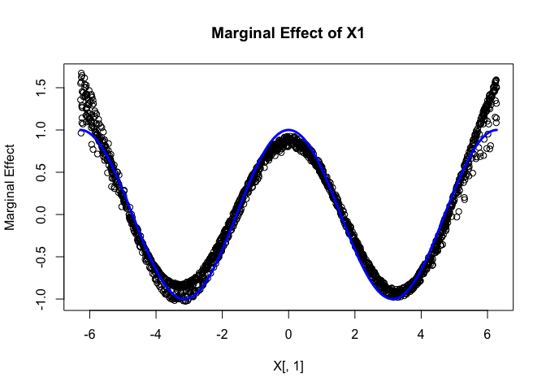

\`Actually' Marginal Effects with bigKRLS
================

This demo shows how well bigKRLS can do estimating 'actually' (as opposed to average) marginal effects without modeling any particular curve. (The true value of the derivative is shown in blue.)

``` r
library(bigKRLS)
N <- 2000
P <- 2
set.seed(11112016)

X <- matrix(runif(N * P, -2*pi, 2*pi), ncol = P)
y <- sin(X[,1]) + X[,2] + rnorm(N)

out <- bigKRLS(y, X, noisy = FALSE, instructions = FALSE)
```

    ...............................................................................................

``` r
plot(x = X[,1], y = out$derivatives[,1], main="Marginal Effect of X1", ylab="Marginal Effect")
lines(seq(-2*pi, 2*pi, 0.01), cos(seq(-2*pi, 2*pi, 0.01)), col="blue", lwd=3)
```


